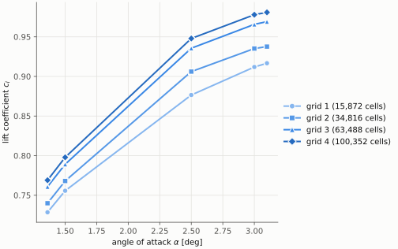
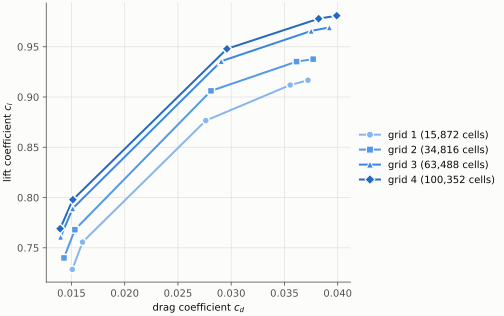
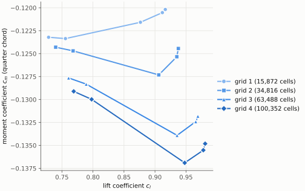
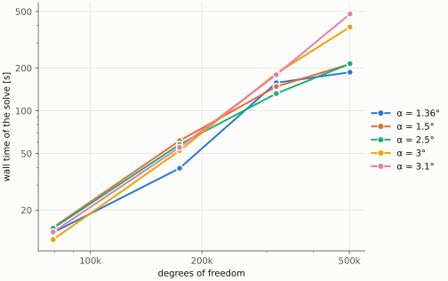

# ONERA OAT15A airfoil: mesh sensitivity study

Steady RANS of the ONERA OAT15A supercritical airfoil on the structured Rizzi grids, run with DRAGonFLy's
p = 0 solver. It compares lift, drag and moment coefficients across grid levels at the transonic conditions
of the OAT15A buffet test case. The cost of each grid is compared too.

> **Status:** the figures below are **preliminary**. They show grids 1–4 only, from earlier limited runs.
> The full sweep over grids 1–7 has not been run yet. Comparisons with
> experimental data and other solvers will be added later.

## Case

| | |
|---|---|
| Geometry | ONERA OAT15A, chord 230 mm (scaled to 1 in the solver), blunt trailing edge |
| Mach number | 0.73 |
| Reynolds number | 3 × 10⁶, based on the chord |
| Static free-stream temperature | 300 K (Sutherland's law) |
| Angles of attack | 1.36°, 1.50°, 2.50°, 3.00°, 3.10° |
| Model | SA-neg RANS, cell-centred finite volume (p = 0), MUSCL inviscid fluxes |
| Boundary conditions | adiabatic no-slip wall; subsonic inflow/outflow far field (~5 × 10⁴ chords away) |
| Solver | pseudo-transient continuation from the free stream (CFL₀ = 5) to a residual of 10⁻⁹ |
| Moment reference | quarter chord, positive nose-up |

Every case starts from the same free stream. Cases run one at a time.

## Grids

The grids are ONERA's structured multi-block CGNS grids made with the Rizzi grid generator
(`meshes/ONERA-ONERA-OAT15A-Rizzi/gridN/OAT15A_Rizzi_N.cgns`; see the ReadMe there). Each is a 3D grid one cell
thick in span. `dragonfly_sim.utils.mesh_io_utils` reads it with PyVista and reduces it in memory to the 2D
quadrilateral mesh the solver uses. No converted mesh file is written. At p = 0 with SA-neg, each cell carries
5 unknowns.

| Grid | Cells | Degrees of freedom |
|---:|---:|---:|
| 1 | 15,872 | 79,360 |
| 2 | 34,816 | 174,080 |
| 3 | 63,488 | 317,440 |
| 4 | 100,352 | 501,760 |
| 5 | 144,384 | 721,920 |
| 6 | 253,952 | 1,269,760 |
| 7 | 471,040 | 2,355,200 |

The first cell height is about 10⁻⁵ chords on every grid (y⁺ ≈ 1 at Re = 3 × 10⁶).

## Results

Each line is one grid's angle-of-attack sweep. Hollow markers would mark cases that did not converge; in the data
shown so far, every case converged.

### Lift coefficient against angle of attack



### Lift coefficient against drag coefficient



### Moment coefficient against lift coefficient



### Cost: wall time against degrees of freedom

Wall time of the steady solve (pseudo-transient continuation only, without model set-up and output), on 8 MPI
ranks of an Intel Core i7-10700 (8 cores). One line per angle of attack.



### Comparison with experiment and other solvers

To be added.

## Running

The full sweep, grids 1–7 at all five angles of attack, one case at a time:

```
cd examples/ONERA-OAT15A
OMP_NUM_THREADS=1 mpirun -n 8 python oat15a_analysis.py --out-dir <output folder>
```

Each run writes a new folder under `--out-dir` containing:

- `results.csv`: one row per case, rewritten after every case. Columns: grid, cells, dofs, alpha, converged,
  steps, residual, `wall_s` (the solve), `case_s` (model set-up + solve), c_l, c_d, c_d_friction, c_m.
- `wall_gridN_aA.csv`: wall C_p and c_f per wall facet.
- The four figures above, in that same folder.

A subset runs with `--grids` and `--alphas`, for example `--grids 1 2 --alphas 2.5`. The SA-neg model, the mesh
input and the force coefficients come from `../flow_analysis.py` and the `dragonfly_sim` package.

To redraw the figures in this README from a results file:

```
python oat15a_analysis.py --plot <run folder>/results.csv --figure-dir figures
```

Figures are SVG by default, so they render here. Use `--format pdf` (or png) for other uses.
